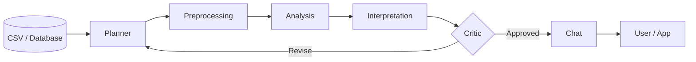

# Autonomous Data Analysis

An agent-based system that turns structured datasets into clear, verified insights. LangGraph coordinates planning, preprocessing, analysis, interpretation, review, and presentation.

## Architecture



The agents share validated tools for dataset inspection, preprocessing, statistics, visualization, and optional machine learning.

## Prerequisites

- [Git](https://git-scm.com/)
- [Python 3.12+](https://www.python.org/downloads/)
- [uv](https://docs.astral.sh/uv/getting-started/installation/)

## Setup

```bash
git clone https://github.com/CogitoNTNU/autonomous-data-analysis.git
cd autonomous-data-analysis
uv sync --project backend
uv run --project backend pre-commit install --config .config/pre-commit-config.yaml
```

## Usage

Inspect the included penguins dataset:

```bash
uv run --project backend python -m backend.app.tools.inspect_dataset
```

The command prints the dataset dimensions, missing values, inferred datatypes, and duplicate-row count.

To inspect another CSV file from Python:

```python
from pathlib import Path
from backend.app.tools.inspect_dataset import inspect_dataset

inspect_dataset(Path("path/to/dataset.csv"))
```

## Project structure

```text
.
├── backend/
│   ├── app/       # API, agents, and analysis tools
│   ├── data/      # Example datasets
│   ├── tests/     # Backend tests
│   ├── .python-version
│   ├── pyproject.toml
│   └── uv.lock
├── frontend/      # React application
├── docs/          # Documentation content and MkDocs config
├── .config/       # Shared development-tool configuration
└── README.md
```

## Testing

```bash
uv run --project backend pytest backend/tests
```

## Team

<table>
  <tr>
    <td align="center"><br><b>Kien Parajes Le</b></td>
    <td align="center"><br><b>Sebastian Jøranger</b></td>
    <td align="center"><br><b>Kristoffer</b></td>
    <td align="center"><br><b>Daniel Samoylov</b></td>
  </tr>
</table>

## License

[MIT](LICENSE)
