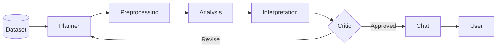

# Autonomous Data Analysis

An agent-based system that turns structured datasets into clear, verified insights.

## Components

- **Backend:** Python agents, APIs, analysis tools, and data processing.
- **Frontend:** React interface for datasets, questions, and results.
- **Documentation:** MkDocs guides and generated API reference.

## Workflow

See the project [README](https://github.com/CogitoNTNU/autonomous-data-analysis#readme) for prerequisites, setup, and usage.
